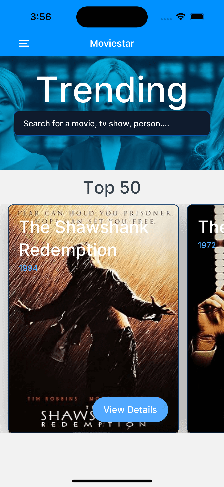
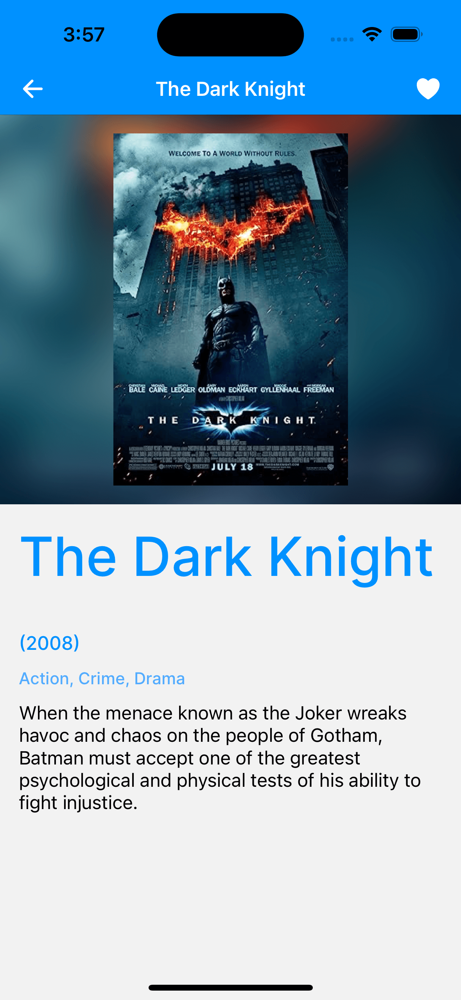
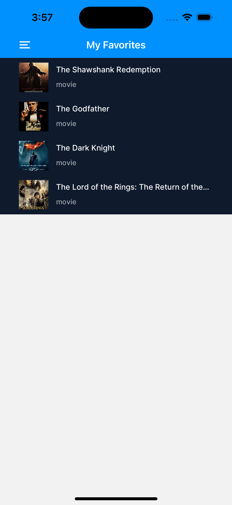

# React Native Movie App

This is a React Native app that connects to [OMDp API](https://www.omdbapi.com/) to request and display movie info using this [Tutorial](https://www.youtube.com/watch?v=r_Smo78tv8Y) by [Simon Grimm](https://github.com/saimon24) as a guide.

## Screenshots

## Features:

- [Expo Router](https://docs.expo.dev/routing/introduction/) file-based navigation
- Home screen with top 50 movies and a search bar
- Favorites screen with favorites management using [MMKV storage](https://github.com/mrousavy/react-native-mmkv)
- Asynchronous state management with [TanStack Query](https://github.com/TanStack/query)
